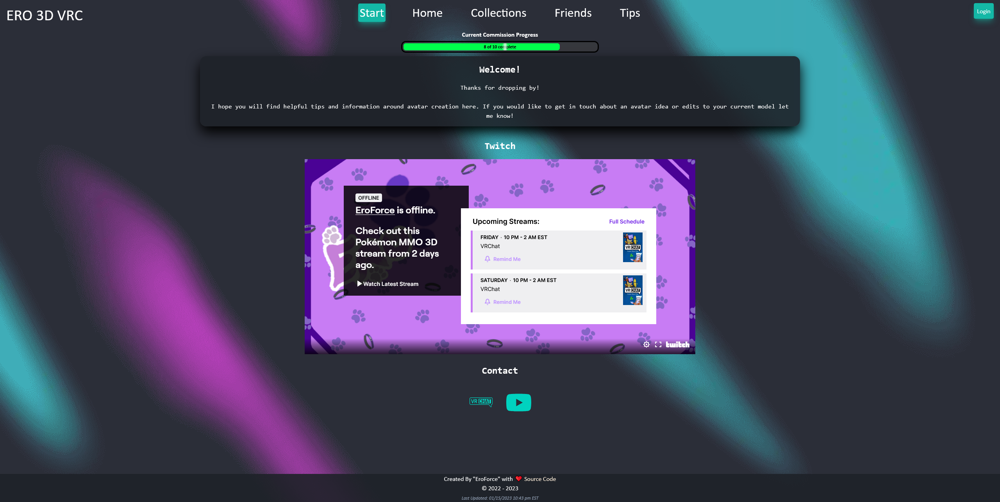

# Ero3D VRC 

## Table of Contents

- [Description](#description)
- [URLs](#urls)
- [Usage](#usage)
- [Images](#images)
- [Credits](#credits)
- [License](#license)
- [Questions](#questions)

## Description

This application is designed for helping Vrchat users with developing their own avatars or finding help from either me or other users that I have listed in the website. It will show avatars that I have worked on and finished, showing certain features that users may be interested in learning more about or requesting avatar assistance. The application will give refrences to base models used and even provide tips for users in certain programs used to create models.

## URLs

GitHub repository: https://github.com/ajlineb/ero3d-vrc

Webpage: https://ero3dvrc.onrender.com/

## Usage

This application will be helpful for new users of vrchat or users wanting to develop their own models and need somewhere to start from. It also helps me showoff my skills in avatar creations and advertise my abilities for other users so they may see if they would like to commission me for an avatar.

## Images

## Credits

Tailwind, React App more to come!

## License

MIT License

## Questions

Contact by:  
GitHub Username: [ajlineb](https://github.com/ajlineb)  
Email: anthonylinebaugh95@gmail.com
